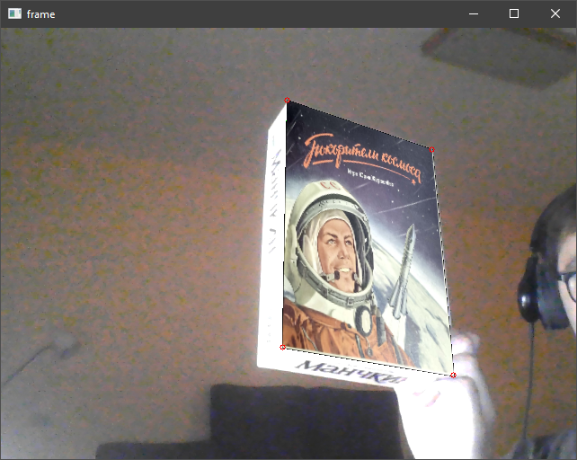

# CV2Image_Replacer
Отрисовка изображения поверх другого (немного дополненной реальности)
===================
1. Находим ключевые точки и дискрипторы алгоритмом SIFT на двух рисунках
2. Распазнаем первый рисунок на видео
3. Вычисляем гомографическую матрицу и маску для получения перспективы рисунка
4. Отрисовываем второй рисунко вместо первого

результат

